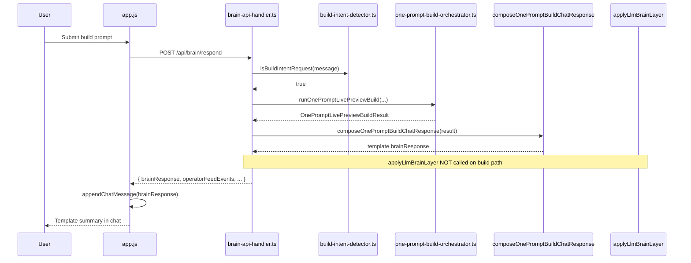

# CHAT_RESPONSE_INTELLIGENCE_AUDIT_V1

**Generated:** evidence from codebase static trace (no synthetic runtime claims)  
**Audit module:** `scripts/lib/chat-response-intelligence-audit-v1-tracer.ts`  
**Verdict:** `CHAT_INTELLIGENCE_PARTIAL` (updated after Build Result Conversational Intelligence V1)

---

## Repair Status — Build Result Conversational Intelligence V1

Implemented:

- `applyBuildResultConversationalIntelligence` wired in `server/brain-api-handler.ts` after build completion
- `composeOnePromptBuildChatResponse` retained as template fallback only
- `analyzeBuildProfileClassification` provides matched keywords and profile mismatch warnings to LLM context
- Operator Feed unchanged (`buildOnePromptOperatorFeedEvents`)

Remaining gaps:

- Profile ranking alternatives not yet stored
- Template fallback still used when LLM disconnected (by design)

---

## Executive Summary (Original Audit — Pre-Repair)

Build execution, workspace generation, and Live Preview work correctly on the one-prompt build path. **Before V1 repair, chat responses after successful builds were not produced by the LLM.** They were formatted by `composeOnePromptBuildChatResponse` — a hardcoded multi-line template — and returned directly from `handleBrainRespondRequest` without calling `applyLlmBrainLayer`.

The client renders `result.brainResponse` verbatim via `appendChatMessage`. This matches the observed mechanical output (`Build run…`, `Workspace…`, `Profile…`, `PASS…`).

Non-build chat requests may receive LLM humanization when a provider is connected, but **build completions always bypass that layer**.

---

## 1. Build Completion Flow — Runtime Trace

| Step | Module | Function | File | Input | Output |
|------|--------|----------|------|-------|--------|
| 1 | founder-reality-ui | `submitBrainRequest` | `public/founder-reality/app.js` | `message`, `activeProjectId` | `POST /api/brain/respond` |
| 2 | build-intent-routing | `isBuildIntentRequest` | `src/build-intent-routing/build-intent-detector.ts` | `body.message` | `boolean` |
| 3 | build-intent-routing + UFCI | `resolveBuildIntentProfile` → `detectUniversalAppProfile` | `src/build-intent-routing/build-intent-detector.ts`, `src/universal-feature-contract-intelligence/universal-feature-contract-builder.ts` | `rawPrompt` | `GeneratedAppProfile \| null` |
| 4 | one-prompt-live-preview | `runOnePromptLivePreviewBuild` | `src/one-prompt-live-preview/one-prompt-build-orchestrator.ts` | prompt, projectRoot, projectId | `OnePromptLivePreviewBuildResult` |
| 5 | one-prompt-live-preview | `composeOnePromptBuildBrainApiPayload` | `src/one-prompt-live-preview/one-prompt-build-chat-response.ts` | `message`, `buildResult` | API payload incl. `brainResponse` |
| 6 | one-prompt-live-preview | `composeOnePromptBuildChatResponse` | `src/one-prompt-live-preview/one-prompt-build-orchestrator.ts` | `OnePromptLivePreviewBuildResult` | template string |
| 7 | server | `handleBrainRespondRequest` → `sendBuildBrainResponse` | `server/brain-api-handler.ts` | payload | JSON (no LLM) |
| 8 | founder-reality-ui | `appendChatMessage(result.brainResponse, 'brain')` | `public/founder-reality/app.js` | `brainResponse` | chat DOM |

### Sequence Diagram



---

## 2. Chat Response Source Audit

### Build completion messages

| Property | Value |
|----------|-------|
| **Source** | Hardcoded formatter (template) |
| **File** | `src/one-prompt-live-preview/one-prompt-build-orchestrator.ts` |
| **Function** | `composeOnePromptBuildChatResponse` |
| **NOT used** | LLM, `processBrainRequest`, `generateLlmBackedChatResponseAsync` |

### Evidence — template formatter

```617:631:src/one-prompt-live-preview/one-prompt-build-orchestrator.ts
export function composeOnePromptBuildChatResponse(result: OnePromptLivePreviewBuildResult): string {
  const profileLabel = result.generatedProfile ?? 'application';
  if (result.status === 'READY') {
    return [
      `Build execution started for project "${result.projectName}" — ${profileLabel} materialization complete.`,
      '',
      `Build run: ${result.buildId}`,
      `Project: ${result.projectId}`,
      `Workspace: ${result.workspacePath ?? result.workspaceId ?? 'unknown'}`,
      `Profile: ${profileLabel}`,
      `Build: ${result.buildResult ?? 'unknown'} (npm install ${result.npmInstallOk ? 'ok' : 'fail'}, npm build ${result.npmBuildOk ? 'ok' : 'fail'})`,
      `Live Preview: ${result.previewUrl ?? 'pending'}`,
      '',
      'Open Live Preview to interact with the generated application.',
    ].join('\n');
  }
```

### Evidence — payload assigns template to brainResponse

```146:147:src/one-prompt-live-preview/one-prompt-build-chat-response.ts
  const brainResponse = composeOnePromptBuildChatResponse(input.buildResult);
```

### Call stack (build path)

1. `public/founder-reality/app.js` → `submitBrainRequest` → `fetch('/api/brain/respond')`
2. `server/brain-api-handler.ts` → `handleBrainRespondRequest`
3. `server/brain-api-handler.ts` → `runOnePromptLivePreviewBuild` (when `isBuildIntent`)
4. `src/one-prompt-live-preview/one-prompt-build-chat-response.ts` → `composeOnePromptBuildBrainApiPayload`
5. `src/one-prompt-live-preview/one-prompt-build-orchestrator.ts` → `composeOnePromptBuildChatResponse`
6. `server/brain-api-handler.ts` → `sendBuildBrainResponse` (**skips** `applyLlmBrainLayer`)
7. `public/founder-reality/app.js` → `appendChatMessage(result.brainResponse, 'brain')`

### Client render

```9010:9012:public/founder-reality/app.js
          removeThinkingMessage();
          appendChatMessage(result.brainResponse, 'brain');
```

---

## 3. LLM Invocation Audit

| Path | LLM after completion? | Status |
|------|----------------------|--------|
| **Build completion** | No | **NO** |
| **Non-build chat** | Optional (`applyLlmBrainLayer` if provider connected) | **PARTIAL** |

### Evidence — build path returns before LLM layer

```202:251:server/brain-api-handler.ts
    if (isBuildIntent) {
      // ... alignment check ...
      try {
        const buildResult = await runOnePromptLivePreviewBuild({ ... });
        const payload = composeOnePromptBuildBrainApiPayload({ message: body.message, buildResult });
        sendBuildBrainResponse(res, payload, buildResult.status);
      } catch (err) { ... }
      return;
    }

    let result = processBrainRequest({ ... });
    result = await applyLlmBrainLayer(result, body.message);
```

### Evidence — build payload declares LLM skipped

```237:241:src/one-prompt-live-preview/one-prompt-build-chat-response.ts
    llmChatBrainDiagnostics: {
      llmConnected: false,
      usedLlm: false,
      skippedReason: 'One-prompt build path uses local deterministic generation — LLM not required',
    },
```

### Chain break

**Build Result → LLM Input → LLM Output → Chat Rendering** breaks at:

`server/brain-api-handler.ts` — build-intent branch returns via `sendBuildBrainResponse` without calling `applyLlmBrainLayer`.

---

## 4. Build Result Payload Audit

Structure from `OnePromptLivePreviewBuildResult` (`src/one-prompt-live-preview/one-prompt-live-preview-types.ts`):

| Field | In build result | In API payload | In chat template | To LLM (build path) |
|-------|-----------------|----------------|------------------|---------------------|
| `buildRunId` / `buildId` | Yes | Yes (`buildRunId`) | Yes (`Build run:`) | **No** |
| `workspacePath` | Yes | Yes | Yes | **No** |
| `profile` / `generatedProfile` | Yes | Yes | Yes | **No** |
| `blueprint` / `architectureSummary` | Via run store | Yes (`buildExecution`) | No (not in template lines) | **No** |
| `featureContracts` / `featureSignals` | Yes | Yes (`onePromptLivePreview`) | No | **No** |
| `previewUrl` | Yes | Yes | Yes | **No** |
| `buildStatus` / `buildResult` | Yes | Yes | Yes | **No** |
| `failureReason` | Yes | Yes | Yes (failure path) | **No** |
| `classificationEvidence` | Partial (synthetic) | Yes (`classification`) | No | **No** |

The LLM does **not** receive the build result payload on the build-completion path.

---

## 5. Classification Explanation Audit

### Profile detection

`detectUniversalAppProfile` in `src/universal-feature-contract-intelligence/universal-feature-contract-builder.ts` uses sequential `includesAny` keyword checks. First matching profile wins. **No ranking, no rejected alternatives, no per-match confidence object is returned.**

Example: expense-related keywords map to `PROJECT_MANAGEMENT_WEB_V1` (lines 70–82), not a dedicated expense profile. CRM keywords map to `CRM_WEB_V1` (lines 45–47).

### What exists in API payload

```226:231:src/one-prompt-live-preview/one-prompt-build-chat-response.ts
    classification: {
      category: 'BUILD',
      confidence: 'HIGH',
      matchedSignals: ['build intent', input.buildResult.generatedProfile ?? 'application'],
      reason: 'Build-intent prompt routed to AiDevEngine autonomous builder execution',
    },
```

This is **synthetic** — not derived from detector keyword hits.

### Can the LLM access classification evidence on build completion?

**No.** `applyLlmBrainLayer` is not invoked; `detectUniversalAppProfile` does not expose matched keywords to downstream systems.

### Missing

- Profile ranking results
- Detector-level matched keywords persisted
- Rejected profile alternatives
- LLM grounding with classification evidence on build path

---

## 6. Humanization Audit

| System | Active on build completion? |
|--------|----------------------------|
| **Template response** | **Yes** |
| **Conversational LLM response** | **No** |

Active output shape matches `composeOnePromptBuildChatResponse` exactly — field labels and execution summary, not natural-language explanation.

---

## 7. Explainability Audit

| Question | Currently explainable in chat? | Gap |
|----------|-------------------------------|-----|
| Why profile chosen | **No** | Detector hits not in brainResponse or LLM input |
| Why build failed | **Partial** | `failureReason` in template only |
| Why build succeeded | **Partial** | Status lines only, no reasoning |
| Why fallback occurred | **No** | Not surfaced to chat |
| Why blueprint selected | **No** | `architectureSummary` in payload, not in chat text |
| Why feature contract included | **No** | `featureSignals` not in chat text |

**Missing connection:** Build result + classification evidence → LLM reasoning layer → chat.

Operator Feed receives richer trail via `appendBuildResponseOperatorLog` (classification, profile, workspace) but chat does not.

---

## 8. Architectural Gap Analysis

### Actual path (build completions)

```
User Prompt
  → POST /api/brain/respond
  → isBuildIntentRequest (true)
  → runOnePromptLivePreviewBuild
  → composeOnePromptBuildChatResponse (template)
  → sendBuildBrainResponse
  → appendChatMessage(brainResponse)
```

### Intended path (not implemented for builds)

```
User Prompt
  → Runtime
  → Build Result
  → LLM Reasoning Layer (applyLlmBrainLayer + build context)
  → Conversational Response
  → Chat
```

### Gap location

`server/brain-api-handler.ts` — between `composeOnePromptBuildBrainApiPayload` and `sendBuildBrainResponse`. The LLM layer exists (`applyLlmBrainLayer` + `generateLlmBackedChatResponseAsync`) but is only wired on the non-build branch.

---

## 9. Verdict

### `CHAT_INTELLIGENCE_PARTIAL`

Post-repair: build completions route through `applyBuildResultConversationalIntelligence` when LLM is connected; template fallback when unavailable.

**Original pre-repair verdict was `CHAT_INTELLIGENCE_BYPASSED`. Evidence below documents the original bypass; see Repair Status section for V1 fix.**

1. `composeOnePromptBuildChatResponse` produces fixed template text — not LLM output.
2. Build-intent branch in `handleBrainRespondRequest` returns before `applyLlmBrainLayer`.
3. Build payload sets `llmChatBrainDiagnostics.usedLlm: false` with explicit skip reason.
4. Client renders `brainResponse` verbatim with no client-side intelligence layer.

Non-build chat is `CHAT_INTELLIGENCE_PARTIAL` (template draft + optional LLM polish), but **build completions are fully bypassed**.

---

## Recommended Repair Plan

1. **Wire LLM after build** — Call `applyLlmBrainLayer` (or a build-specific composer) on the build-intent path, passing `draftResponse` from the template plus structured `buildResult`, `buildExecution`, and `classification`.
2. **Enrich classification evidence** — Change `detectUniversalAppProfile` to return `{ profile, matchedKeywords, confidence, alternatives }` and include in API payload and LLM context.
3. **Ground LLM with build payload** — Extend `buildDevPulseContextPackage` / context hydration to ingest `onePromptLivePreview` and `buildExecution` for build-completion turns.
4. **Preserve template fallback** — Keep `composeOnePromptBuildChatResponse` as `draftResponse` when LLM is disconnected; update `llmChatBrainDiagnostics` to reflect actual connection state.
5. **Explain profile mismatches** — Surface detector keyword evidence in chat when profile may surprise the user (e.g. expense → `PROJECT_MANAGEMENT_WEB_V1` mapping in `universal-feature-contract-builder.ts`).

---

## Validation

Run:

```bash
npm run validate:chat-response-intelligence-audit-v1
```

Expected token: `CHAT_RESPONSE_INTELLIGENCE_AUDIT_V1_PASS`
