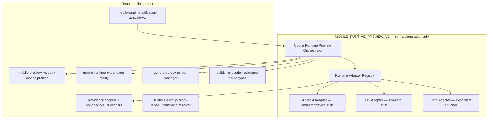

# MOBILE_RUNTIME_PREVIEW_EXISTENCE_AUDIT_V1

Generated: 2026-06-25  
Mode: **Read-only audit** — no code changes, no implementation artifacts.

## Executive summary

AiDevEngine contains **substantial mobile-related infrastructure**, but it clusters into two distinct families that must not be conflated:

1. **Founder mobile operations** — command, chat, approval, push, cross-device session metadata for operating DevPulse *from* a phone/tablet (`mobile-command-*`, `mobile-chat-*`, `mobile-approval-*`, `mobile-push`, etc.). These are **active** and validated, but they do **not** launch Android/iOS app runtimes.

2. **Mobile *app* runtime preview / verification** — responsive web preview intelligence, Playwright viewport checks, static workspace signal analysis, and explicit future extension points for native runtimes. **No module actually launches Android emulator, iOS simulator, Expo Go, or React Native runtimes today.**

The codebase already documents this gap honestly: `mobile-runtime-experience-reality` scores **22/100** and states Android/iOS/Expo runtimes are **not proven** (`architecture/MOBILE_RUNTIME_EXPERIENCE_REALITY_REPORT.md`).

**Verdict:** `MOBILE_RUNTIME_PREVIEW_V1` is **still needed** if the goal is *real* native mobile runtime preview — but it must **extend and wire** existing partial capabilities, not create parallel subsystems.

---

## Capability matrix

| Capability | Exists | Partial | Missing | Notes |
|------------|--------|---------|---------|-------|
| 1. Android runtime execution | | ✓ | | Extension points only (`FUTURE_MOBILE_BUILD_SESSION_TYPES`, `FUTURE_MOBILE_RUNTIME_EVIDENCE_TYPES`). No `adb`, Gradle, or APK launch. |
| 2. Android emulator integration | | | ✓ | Explicitly forbidden in `mobile-preview-modes` (`NO_EMULATOR_LAUNCH`). |
| 3. Android device simulation | | ✓ | | Viewport metadata profiles (`ANDROID_PHONE_*`) + Playwright `setViewportSize` on Chromium — not Android WebView/emulator. |
| 4. Expo Go integration | | | ✓ | `expo` detected in `runtime-command-resolver` and `FRAMEWORK_DEFAULT_PORTS.EXPO=8081`; no `expo start` execution path. |
| 5. Expo runtime validation | | ✓ | | Framework hint + port constant only; startup proof targets Vite/web workspaces under `.generated-builder-workspaces/`. |
| 6. React Native runtime support | | | ✓ | No `react-native` dependency; no RN packager/metro integration. |
| 7. Mobile runtime verification | | ✓ | | `mobile-runtime-validation-at-scale-v1` — static HTML/source heuristics + layout analyzers on **web** dist artifacts. |
| 8. Mobile-specific UVL | | ✓ | | `mobile-uvl-integration` adjusts confidence from web mobile proof; UVL panels expose mobile *command/chat/preview* foundations, not native UVL. |
| 9. Mobile-specific Founder Testing | | ✓ | | `MOBILE_FIRST` founder simulation scenario (prompt/planning only); AFLA mobile coverage penalty/boost; no native device test harness. |
| 10. iOS simulator integration | | | ✓ | No Xcode/simctl references; `IPHONE_*` profiles are viewport dimensions only. |
| 11. iOS runtime verification | | ✓ | | Same as Android — responsive web signal analysis, not Simulator. |
| 12. TestFlight-style validation | | ✓ | | `TESTFLIGHT_RUNTIME` listed as future evidence type; never collected. |
| 13. Mobile launch readiness | | ✓ | | AFLA `mobile-afla-integration` penalizes incomplete web mobile coverage; no native launch gate. |
| 14. Device viewport verification beyond responsive browser | | ✓ | | Playwright Chromium + `VIEWPORTS.mobile` (375×667) and `device-profile-library` (up to 10 profiles). Browser-only. |
| 15. Runtime adapters extensible to Mobile Runtime Preview | ✓ | | | `playwright-adapter`, `generated-dev-server-manager`, `connected-runtime-activation-proof`, `runtime-startup-proof-repair`, `bounded-visual-runtime-verifier`, `domain-visual-runtime-verifier`. |

---

## Discovered capabilities (by module)

### A. Native runtime launch (Android / iOS / Expo / RN)

| Module | Path | Purpose | Status | Active? | Browser-only? | Launches Android/iOS? | Confidence |
|--------|------|---------|--------|---------|---------------|----------------------|------------|
| Future mobile build sessions | `src/controlled-builder-execution-engine/controlled-builder-execution-engine-bounds.ts` | Reserved `ANDROID_BUILD_SESSION`, `IOS_BUILD_SESSION`, `EXPO_BUILD_SESSION` types | **Planned / not implemented** | Metadata only | N/A | No | **High** |
| Future mobile runtime evidence | `src/autonomous-builder-execution-foundation/builder-execution-evidence.ts` | Reserved `ANDROID_RUNTIME_STARTED`, `IOS_RUNTIME_STARTED`, `EXPO_RUNTIME_STARTED`, `TESTFLIGHT_RUNTIME` | **Planned / not implemented** | Registry exists; no producers | N/A | No | **High** |
| Runtime command resolver | `src/connected-runtime-activation-proof/runtime-command-resolver.ts` | Detects `expo` in package.json scripts/deps; does **not** execute | **Partial** | Active (read-only) | N/A | No | **High** |
| Runtime startup proof repair | `src/runtime-startup-proof-repair/runtime-startup-proof-repair-registry.ts` | `EXPO: 8081` port map; bounded web workspace probe | **Partial** | Active for Vite/web | Yes (Chromium probe) | No | **High** |
| Connected runtime activation proof | `src/connected-runtime-activation-proof/` | Spawns `npm run dev/start` under generated workspaces | **Web runtime only** | Active | Yes | No | **High** |

### B. Responsive / viewport “mobile preview” (browser simulation)

| Module | Path | Purpose | Status | Active? | Browser-only? | Launches Android/iOS? | Confidence |
|--------|------|---------|--------|---------|---------------|----------------------|------------|
| Mobile Preview Modes | `src/mobile-preview-modes/` | Device profiles, layout/navigation/risk analysis | **Active** | Yes (`validate:mobile-preview-modes`) | Yes | No | **High** |
| Device profile library | `src/mobile-preview-modes/device-profile-library.ts` | Android/iPhone/tablet viewport dimensions | **Active** | Yes | Yes (metadata) | No | **High** |
| Mobile Live Preview Foundation | `src/mobile-live-preview-foundation/` | Preview session/capability governance for founder mobile viewer | **Active** | Yes | Yes (no rendering) | No | **High** |
| Mobile Preview Runtime Foundation | `src/mobile-preview-runtime/` | Session tracking, device policy metadata, cloud/build/verification bridges | **Active** | Yes | Yes (metadata/links) | No | **High** |
| Universal App Blueprint Visual | `src/universal-app-blueprint-visual/` | Playwright responsive checks (mobile/tablet/desktop viewports) | **Active** | Yes | Yes (Chromium) | No | **High** |
| Bounded visual runtime verifier | `src/aidevengine-build-proof-v1-3/bounded-visual-runtime-verifier.ts` | Build-proof Playwright + viewport checks | **Active** | Yes | Yes | No | **High** |
| Domain visual runtime verifier | `src/aidevengine-multi-domain-build-proof-v1/domain-visual-runtime-verifier.ts` | Multi-domain Playwright + mobile/desktop viewport | **Active** | Yes | Yes | No | **High** |
| Mobile visual analyzer | `src/product-reality-verification/visual-qa-engine/mobile-visual-analyzer.ts` | CSS/media-query/nav-toggle heuristics | **Active** | Yes | Yes | No | **High** |
| Engineering Reality Authority | `src/engineering-reality-authority/` | Playwright performance/runtime health on preview URL | **Active** | Yes | Yes | No | **High** |
| Browser verification | `src/browser-verification/` | Real-browser checks via Playwright Chromium | **Active** | Yes | Yes | No | **High** |
| Generated dev server manager | `src/one-prompt-live-preview/generated-dev-server-manager.ts` | Vite dev server for generated web workspaces | **Active** | Yes | Yes (web) | No | **High** |
| Playwright adapter | `src/playwright-adapter/playwright-page-types.ts` | Shared page/locator interface for validators | **Active** | Yes | Yes | No | **High** |

### C. “Mobile runtime validation” (web artifact heuristics — naming risk)

| Module | Path | Purpose | Status | Active? | Browser-only? | Launches Android/iOS? | Confidence |
|--------|------|---------|--------|---------|---------------|----------------------|------------|
| Mobile Runtime Validation at Scale V1 | `src/mobile-runtime-validation-at-scale-v1/` | 10 web categories × 4 viewport profiles; touch/nav/workflow **signal** scoring | **Active** (`MOBILE_RUNTIME_VALIDATION_AT_SCALE_V1_PASS`) | Yes | **Effectively yes** (HTML/source analysis on `dist/index.html`) | No | **High** |
| Mobile workspace evidence | `src/mobile-runtime-validation-at-scale-v1/mobile-workspace-evidence.ts` | Extracts viewport meta, buttons, nav tokens from web workspaces | **Active** | Yes | Yes | No | **High** |
| Mobile World2 runner | `src/mobile-runtime-validation-at-scale-v1/mobile-world2-runner.ts` | Runs World2 web builds then validates profiles | **Active** | Yes | Yes | No | **High** |
| Mobile UVL integration | `src/mobile-runtime-validation-at-scale-v1/mobile-uvl-integration.ts` | Confidence boost from web mobile category proof | **Active** | Yes | N/A | No | **High** |
| Mobile AFLA integration | `src/mobile-runtime-validation-at-scale-v1/mobile-afla-integration.ts` | Launch score penalty/boost from web mobile coverage | **Active** | Yes | N/A | No | **High** |
| Founder Reality UI panel | `public/founder-reality/app.js` | Displays mobile runtime validation + experience scores | **Active** | Yes | N/A | No | **High** |
| Server handler | `server/mobile-runtime-validation-handler.ts` | `/api/founder/mobile-runtime-validation-at-scale-v1` | **Active** | Yes | N/A | No | **Medium** |

### D. Mobile runtime *reality* audit (explicit gap documentation)

| Module | Path | Purpose | Status | Active? | Browser-only? | Launches Android/iOS? | Confidence |
|--------|------|---------|--------|---------|---------------|----------------------|------------|
| Mobile Runtime Experience Reality | `src/mobile-runtime-experience-reality/` | Read-only authority; scores device frame / Android / iOS / Expo **without** launching | **Active** (22/100) | Yes (`validate:mobile-runtime-experience-reality`) | Audit only | No | **High** |
| Architecture report | `architecture/MOBILE_RUNTIME_EXPERIENCE_REALITY_REPORT.md` | Documents unproven native runtimes | **Current** | Yes | N/A | No | **High** |

### E. Founder mobile *operations* (not app runtime preview — high duplicate-risk if misnamed)

| Module | Path | Purpose | Status | Active? | Browser-only? | Launches Android/iOS? | Confidence |
|--------|------|---------|--------|---------|---------------|----------------------|------------|
| Mobile Command Foundation/Runtime | `src/mobile-command-foundation/`, `src/mobile-command-runtime/` | Founder issues commands from mobile; links to cloud/build/verification | **Active** | Yes | N/A | No | **High** |
| Mobile Chat Interface/Runtime | `src/mobile-chat-interface/`, `src/mobile-chat-runtime/` | Mobile chat sessions and bridges | **Active** | Yes | N/A | No | **High** |
| Mobile Approval Flow/Runtime | `src/mobile-approval-flow-foundation/`, `src/mobile-approval-runtime/` | Approval workflows from mobile | **Active** | Yes | N/A | No | **High** |
| Mobile Push | `src/mobile-push/` | Push notification metadata/routing (no real delivery) | **Active** | Yes | N/A | No | **High** |
| Cross-device runtime | `src/cross-device-runtime-foundation/` (referenced) | Cross-device session linking | **Active** | Yes | N/A | No | **Medium** |
| Device validation engine | `src/mobile-command-foundation/device-validation-engine.ts` | Validates `ANDROID`/`IOS` **platform enum** on session input | **Active** | Yes | Metadata only | No | **High** |
| Founder notification mobile bridge | `src/founder-notification-runtime/founder-notification-mobile-bridge.ts` | Cross-device notification visibility | **Active** | Yes | N/A | No | **High** |

### F. Founder testing / simulation / launch (mobile-adjacent)

| Module | Path | Purpose | Status | Active? | Browser-only? | Launches Android/iOS? | Confidence |
|--------|------|---------|--------|---------|---------------|----------------------|------------|
| Founder simulation MOBILE_FIRST | `src/founder-simulation-engine/simulation-scenario-library.ts` | Uber-style iOS/Android **prompt** scenario | **Active** | Yes | Planning only | No | **High** |
| Preview intelligence | `src/preview-intelligence/` | `MOBILE_PREVIEW_REQUIRES_DESKTOP` limitation | **Active** | Yes | Yes | No | **High** |
| Live preview gatekeeper | `src/product-reality-verification/live-preview-gatekeeper/` | `MobilePreviewDevicePolicy` presence check | **Active** | Yes | Yes | No | **Medium** |
| Autonomous Founder Launch Authority | `src/autonomous-founder-launch-authority/` | Launch readiness; consumes pipeline evidence (web) | **Active** | Yes | Web-focused | No | **High** |
| UVL panel registry | `src/unified-verification-lab/uvl-panel-registry.ts` | Mobile command/chat/preview/approval panels | **Active** | Yes | N/A | No | **High** |

### G. Dead / placeholder / mention-only

| Module | Path | Purpose | Status | Active? | Notes | Confidence |
|--------|------|---------|--------|---------|-------|------------|
| Founder interaction simulation | `src/founder-interaction-simulation/` | Referenced by mobile-runtime-experience-reality | **Partial signal** | Referenced | No touch/device simulation implementation found in module grep | **Medium** |
| Code-gen Android examples | `scripts/validate-code-generation-planner-foundation.ts` | Example prompt "Android expense tracker" | **Fixture only** | Test data | Not runtime | **High** |
| Cloud execution path | `src/cloud-execution-path-v1/` (artifacts) | Cloud build jobs | **Web build** | Active for web | No mobile native path in source grep | **Medium** |

---

## Answers A–G

### A. Can AiDevEngine currently launch a real Android runtime?

**No.** There is no emulator, `adb`, APK install, or Android WebView host. `ANDROID_BUILD_SESSION` and `ANDROID_RUNTIME_STARTED` are reserved future types only. `device-validation-engine` accepts `platform: 'ANDROID'` as session metadata, not OS launch.

### B. Can AiDevEngine currently launch a real iOS runtime?

**No.** No Simulator, simctl, Xcode, or TestFlight integration. `IPHONE_*` device profiles are viewport dimensions for responsive analysis.

### C. Can AiDevEngine currently verify Android behaviour?

**Only partially, and only for responsive web apps.** `mobile-runtime-validation-at-scale-v1` and Playwright viewport checks validate web `dist/index.html` artifacts against Android-sized viewports and heuristics (touch classes, nav tokens). This is **not** Android OS or WebView behaviour verification.

### D. Can AiDevEngine currently verify iOS behaviour?

**Same as C — partial web-only.** iPhone viewport profiles + Chromium `setViewportSize`; no iOS Simulator or Safari WebKit engine checks.

### E. Can AiDevEngine currently perform mobile Founder Testing?

**Partial.** Founder simulation includes a `MOBILE_FIRST` scenario (planning/journey). Mobile command/chat/approval runtimes support founder workflows **from** mobile devices. There is no founder test harness that exercises a built app on a real or emulated mobile device.

### F. Can AiDevEngine currently perform mobile Launch Readiness?

**Partial (web mobile coverage only).** `mobile-afla-integration` adjusts AFLA scores based on web mobile category proof. Multi-domain and build-proof pipelines include Playwright mobile viewport gates. Native mobile launch readiness is **not** implemented.

### G. Which existing modules should be reused if MOBILE_RUNTIME_PREVIEW_V1 is built?

| Reuse target | Modules |
|--------------|---------|
| Device profiles & layout intelligence | `mobile-preview-modes`, `device-profile-library`, `preview-layout-analyzer`, `mobile-navigation-analyzer` |
| Preview session governance | `mobile-live-preview-foundation`, `mobile-preview-runtime` |
| Web preview server | `one-prompt-live-preview/generated-dev-server-manager` |
| Playwright verification shell | `playwright-adapter`, `bounded-visual-runtime-verifier`, `domain-visual-runtime-verifier`, `universal-app-blueprint-visual` |
| Runtime command detection | `connected-runtime-activation-proof/runtime-command-resolver`, `runtime-startup-proof-repair` |
| Evidence & launch handoff | `autonomous-builder-execution-foundation/builder-execution-evidence`, `aidevengine-build-proof` visual runtime types |
| Reality / gap honesty | `mobile-runtime-experience-reality` (extend, do not replace) |
| UVL/AFLA hooks | `mobile-uvl-integration`, `mobile-afla-integration` |
| Founder UI surfacing | `public/founder-reality/app.js`, `server/mobile-runtime-validation-handler` |

**Do not reuse as native preview:** `mobile-command-*`, `mobile-chat-*`, `mobile-approval-*`, `mobile-push` — these are founder **operator** surfaces, not app runtime hosts.

---

## DUPLICATE_RISK findings

| ID | Risk | Existing name(s) | Recommendation |
|----|------|------------------|----------------|
| **DR-01** | **HIGH** | `mobile-preview-modes`, `mobile-preview-runtime`, `mobile-live-preview-foundation` | **DUPLICATE_RISK** — Any new "Mobile Runtime Preview" device-frame/responsive subsystem duplicates Phase 26.27 preview modes. Extend with native launch adapters behind same profile IDs. |
| **DR-02** | **HIGH** | `mobile-runtime-validation-at-scale-v1` | **DUPLICATE_RISK** — Name implies native runtime; implementation is web heuristic validation. V1 should add a distinct proof tier (e.g. `NATIVE_RUNTIME_PROVEN` vs `RESPONSIVE_WEB_PROVEN`) rather than a parallel validator. |
| **DR-03** | **HIGH** | `mobile-runtime-experience-reality` | **DUPLICATE_RISK** — Already the canonical honesty authority for Android/iOS/Expo proof levels. Wire new launch evidence into its workspace signals; do not create a second reality scorer. |
| **DR-04** | **MEDIUM** | `domain-visual-runtime-verifier`, `bounded-visual-runtime-verifier`, `universal-app-blueprint-visual` | **DUPLICATE_RISK** — Three Playwright+viewport pipelines. V1 should add optional native preview checks to one bounded verifier interface, not a fourth copy. |
| **DR-05** | **MEDIUM** | `mobile-visual-analyzer` (PRV) vs `mobile-preview-modes` | **DUPLICATE_RISK** — Overlapping responsive risk analysis. Consolidate scoring inputs. |
| **DR-06** | **HIGH** | `mobile-command-runtime` / `mobile-preview-runtime` naming | **DUPLICATE_RISK (semantic)** — "Mobile preview" in operator modules means preview **links on a phone**, not Android/iOS app preview. Document namespace: `founder-mobile-*` vs `app-runtime-mobile-*`. |
| **DR-07** | **LOW** | `runtime-startup-proof-repair` + `connected-runtime-activation-proof` | **DUPLICATE_RISK** — Both resolve startup commands. Native Expo/RN boot should extend existing command resolution, not new spawn logic. |
| **DR-08** | **MEDIUM** | `MOBILE_RUNTIME_VALIDATION_AT_SCALE_V1_REPORT.md` claims "mobile runtime profiles" | **Misleading evidence** — Report language can be read as native proof; audit treats as responsive web unless workspace contains RN/Expo artifacts. |

---

## Recommended architecture (if MOBILE_RUNTIME_PREVIEW_V1 proceeds)

### Principles

1. **Single proof ladder:** `RESPONSIVE_WEB_PROVEN` → `DEVICE_FRAME_PROVEN` → `NATIVE_RUNTIME_PROVEN` — recorded via existing `FUTURE_MOBILE_RUNTIME_EVIDENCE_TYPES`.
2. **One Playwright entrypoint** — extend `bounded-visual-runtime-verifier` / `domain-visual-runtime-verifier` with optional native WebView/deep-link checks later; keep Chromium responsive checks as baseline.
3. **Honesty gate** — `mobile-runtime-experience-reality` remains the scoreboard; V1 cannot pass until workspace signals include real `androidRuntimeLaunchEvidence` / `iosRuntimeLaunchEvidence` / `expoRuntimeLaunchEvidence`.
4. **Namespace separation** — Founder operator modules (`mobile-command-*`, etc.) stay out of app runtime preview orchestration.
5. **No fourth mobile validator** — Extend `mobile-runtime-validation-at-scale-v1` assessor with native proof inputs rather than `mobile-runtime-preview-v1-validator` as a parallel chain.

### Explicit non-goals for V1 (already covered elsewhere)

- Founder mobile command/chat/approval (keep separate)
- Push notification delivery
- Cloud job packaging for web builds (already in cloud-execution-path)

---

## Validation

| Check | Result |
|-------|--------|
| Code modified | **No** |
| Implementation generated | **No** |
| Artifact directories created | **No** |
| Audit report produced | **Yes** — this file |

---

## Report path

`MOBILE_RUNTIME_PREVIEW_EXISTENCE_AUDIT_V1_REPORT.md`
