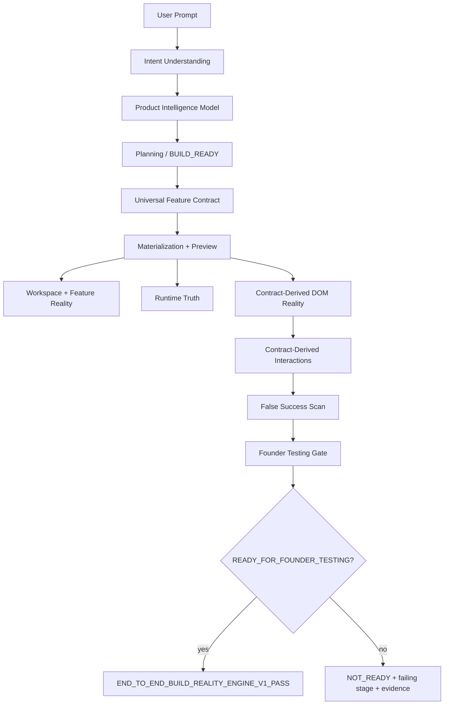

# End-to-End Build Reality Engine V1 — Report

Generated after completing the constitutional end-to-end engineering authority for AiDevEngine.

## Purpose

Prove that **engineering reality matches user-visible application reality** before AiDevEngine may declare a build successful or issue `READY_FOR_FOUNDER_TESTING`.

The engine is **generic**: expectations are always derived from the Product Intelligence Model, Universal Feature Contract, generated workspace artifacts, and contract-derived interaction discovery — never from hardcoded application types.

## Module Layout

```
src/end-to-end-build-reality-engine-v1/
├── e2e-build-reality-types.ts          — verdict, stages, evidence types
├── e2e-build-reality-authority.ts      — main orchestrator
├── contract-expectation-extractor.ts   — PIM/UFC/registry/manifest expectations
├── contract-derived-plan-generator.ts  — validation steps from contract only
├── feature-source-interaction-discovery.ts — DOM control discovery from source
├── e2e-dom-reality-runner.ts           — Playwright contract-derived DOM + interactions
├── false-success-detector.ts           — blocks READY on visible/engineering mismatch
├── evidence-collector.ts               — screenshots, DOM, tree, replay, hashes
├── e2e-authority-integrations.ts       — workspace/feature/runtime/founder probes
├── e2e-regression-prompts.ts           — prompt-only regression registry
└── index.ts                            — public API
```

## Pipeline Stages

| Stage | Authority |
|-------|-----------|
| INTENT_UNDERSTANDING | Requirements-to-plan / user idea contract |
| PRODUCT_INTELLIGENCE | Product Intelligence Model |
| PLANNING | BUILD_READY execution contract |
| ARCHITECTURE | PIM architecture profile |
| UNIVERSAL_FEATURE_CONTRACT | Universal Feature Contract builder |
| MATERIALIZATION | One-prompt live preview build |
| COMPILATION | npm install + build |
| AUTO_REPAIR | Build orchestrator AutoFix delegation |
| LIVE_PREVIEW | Preview URL availability |
| RUNNING_APPLICATION | Build status READY + PASS |
| WORKSPACE_REALITY_AUDIT | Workspace Reality Audit V1 |
| FEATURE_REALITY | Feature Contract Reality fallback |
| RUNTIME_TRUTH | Runtime Truth Authority health |
| DOM_REALITY | Contract-derived mounted feature + UI terms |
| INTERACTIVE_REALITY | Contract-derived workflows (button sequences, CRUD) |
| FALSE_SUCCESS_SCAN | Generic shell / stale preview / workflow gaps |
| FOUNDER_TESTING_GATE | Visible reality ready for founder testing |
| FINAL_VERDICT | `READY_FOR_FOUNDER_TESTING` or `NOT_READY` |

## Engineering Verdict

- **`READY_FOR_FOUNDER_TESTING`** — all critical stages/checks pass; visible application matches contract-derived expectations.
- **`NOT_READY`** — includes exact `failingStage` and supporting evidence paths under `.end-to-end-build-reality/<projectId>/`.

Pass token: `END_TO_END_BUILD_REALITY_ENGINE_V1_PASS`

## Evidence Collected

| Artifact | Path |
|----------|------|
| Screenshot | `.end-to-end-build-reality/<id>/preview-screenshot.png` |
| DOM snapshot | `dom-snapshot.html` |
| Mounted component tree | `mounted-component-tree.json` |
| Route table | `route-table.json` |
| Feature registry | workspace `src/features/registry.ts` |
| Runtime truth | `runtime-truth.json` |
| Interaction replay | `interaction-replay.json` |
| Workspace / preview hash | report `evidence.workspaceHash`, `evidence.previewHash` |

## Pipeline Integration

- **`one-prompt-live-preview/one-prompt-build-orchestrator.ts`** — after preview is available, runs `runEndToEndBuildReality({ skipFullBuild: true })` and blocks final `READY`/`PASS` when verdict is `NOT_READY`.
- Replaces calculator-specific visible preview validation with generic contract-derived validation for all application types.

## Validation

```bash
npm run validate:end-to-end-build-reality-engine-v1
```

CI subset exercises calculator, todo, and expense-tracker prompts with no application-specific validator logic.

## Architecture Summary



## Remaining Gaps

1. **Full founder testing execution** — gate confirms visible readiness; full Founder Testing V4/V5 orchestration remains downstream.
2. **Live runtime truth in generated preview** — preview workspace hash meta tag adoption is still inconsistent across all materialization profiles.
3. **Non-Playwright CI environments** — DOM/interaction validation degrades gracefully when Playwright is unavailable; verdict is `NOT_READY` with explicit stage detail.
4. **Universal Feature Contract drift** — workspace contracts occasionally contain stale entity templates; extractor filters by feature module alignment but upstream contract generation quality remains a separate concern.

## Implementation Summary

- Completed orchestrator with 18 pipeline stages and constitutional final verdict authority.
- Fixed contract-derived criticality: semantic prompt hints (`numbers`, `operators`) no longer treated as mandatory button labels.
- Filtered UFC action verbs and entity terms to registered feature modules only.
- Wired engine into the one-prompt build orchestrator as the generic visible-reality gate.
- Expanded evidence collection and cross-authority integration probes.
