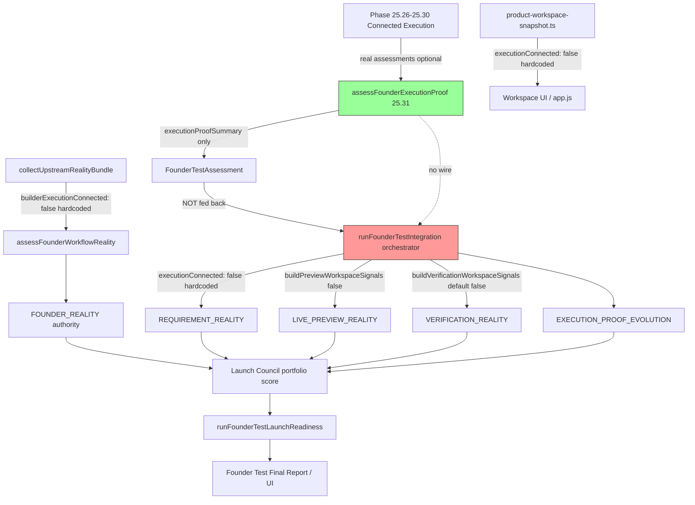

# Execution Proof Propagation Audit

**Phase:** 25.33 — READ-ONLY propagation audit  
**Date:** 2026-06-12  
**Question:** Why does Founder Execution Proof report all stages proven (~94%) while Founder Test Launch Readiness still behaves as if `executionConnected=false`?

---

## Executive Summary

**Verdict: propagation is architecturally absent, not stale.**

Phase **25.31 Founder Execution Proof** and Phase **24A/24F Founder Test** operate on **two separate truth models** that are **not wired together**. The boolean `executionConnected` used by Founder Reality, Requirement Reality, Live Preview Reality, Verification Reality, and Launch Council **never reads** Founder Execution Proof output. It is **hardcoded to `false`** in the Founder Test Integration orchestrator and upstream workflow collectors.

Founder Execution Proof can correctly report workspace → build → runtime → preview → verification as proven (when real connected assessments are supplied, e.g. in validators). That truth **does not propagate** into the 24A authority pipeline that drives Founder Test Launch Readiness scores and blockers.

**First divergence layer:** `collectUpstreamRealityBundle()` and `founder-test-integration-orchestrator.ts` — both set `executionConnected: false` / `builderExecutionConnected: false` **before** any downstream authority runs.

---

## Two Parallel Truth Systems

| Dimension | Phase 25.31 Founder Execution Proof | Phase 24A/24F Founder Test Pipeline |
|-----------|-------------------------------------|-------------------------------------|
| Primary signal | `founderExecutionProven`, stage contracts, `executionChainConnected` | `executionConnected` / `builderExecutionConnected` |
| Evidence source | Connected workspace/build/runtime/preview/verification (25.26–25.30) | Autonomous builder workspace model + leaf preview/verification inputs |
| Uses `executionConnected`? | **No** | **Yes** — gates BUILD, preview, verification, workflow |
| Attached to Founder Test when? | **After** authority collection (`executionProofSummary`) | **During** authority collection (scores/blockers) |
| API `/api/founder-test/run` passes connected assessments? | **No** | N/A — uses hardcoded leaf inputs |

---

## Propagation Trace



---

## Layer-by-Layer Audit

### 1. Founder Execution Proof (Phase 25.31)

| Field | Detail |
|-------|--------|
| **Source of `executionConnected`** | **Does not use this field.** Uses `questionAnswers.founderExecutionProven`, per-stage `proven` flags, and connected assessment contracts. |
| **Value mechanism** | **Computed** from injected or chained connected-* assessments in `execution-proof-aggregator.ts`. |
| **Caching** | In-memory bounded history (`founder-execution-proof-history.ts`, max 16). Not shared with 24A authorities. |
| **Registry** | Constants only — no shared execution-connected registry. |
| **Observed value** | With real validator chain: all stages proven, ~94% overall, `FOUNDER_EXECUTION_PROVEN_WITH_WARNINGS` or `FOUNDER_EXECUTION_PROVEN`. |
| **Timestamp** | `report.generatedAt` on each assessment. |

**Output attachment:** `assessFounderTestIntegration()` calls `assessFounderExecutionProof()` **after** `runFounderTestIntegration()` completes. Result stored in `assessment.executionProofSummary` only.

**Critical gap:** `founderExecutionProofInput` is only used in `scripts/validate-founder-execution-proof.ts`. **`server/founder-testing-handler.ts` does not pass it.**

---

### 2. Execution Proof Authority (24E — Execution Proof Evolution)

| Field | Detail |
|-------|--------|
| **Source of `executionConnected`** | **Does not use this field.** |
| **Value mechanism** | **Computed** from portfolio authority scores via `buildExecutionProofInput()` in orchestrator. |
| **Inputs** | Blockers/scores from authorities already computed with `executionConnected=false`. |
| **Observed behavior** | Reflects low portfolio scores; unrelated to 25.31 connected chain proof. |

Located: `src/founder-test-integration/founder-test-integration-orchestrator.ts` → `collectExecutionProofEvolution()`.

---

### 3. Founder Reality (24A — End-to-End Founder Workflow Reality)

| Field | Detail |
|-------|--------|
| **Source of `executionConnected`** | **`upstream.builderExecutionConnected`** |
| **Producer** | `collectUpstreamRealityBundle(rootDir)` |
| **Value mechanism** | **Hardcoded** — always `false` at assignment time (line 155), independent of `assessAutonomousBuilderReality()` input (line 130 also hardcodes `executionConnected: false`). |
| **Caching** | Workflow history/registry — does not cache `executionConnected`. |
| **Observed value** | `builderExecutionConnected=false` always in live Founder Test path. |
| **Downstream effect** | BUILD stage → `BLOCKED`; score capped at 46; CRITICAL blocker on workflow. |

File: `src/end-to-end-founder-workflow-reality/end-to-end-founder-workflow-reality-analyzers.ts`

Collector invoked from: `collectFounderReality()` in orchestrator → `assessFounderWorkflowReality(rootDir)`.

---

### 4. Requirement Reality (24A.1 — Autonomous Builder Reality)

| Field | Detail |
|-------|--------|
| **Source of `executionConnected`** | **`workspace.executionConnected`** passed into `assessAutonomousBuilderReality()` |
| **Value mechanism** | **Hardcoded literal** in orchestrator — not loaded from snapshot, registry, or 25.31. |
| **Observed value** | `false` |

```156:167:src/founder-test-integration/founder-test-integration-orchestrator.ts
function collectRequirementReality(rootDir: string): FounderTestAuthorityResult {
  const moduleEvidence = detectModulePresenceEvidence(rootDir);
  const assessment = assessAutonomousBuilderReality({
    workspace: {
      world2FoundationComplete: true,
      executionConnected: false,
      readiness: 'foundation',
      readinessLabel: 'Foundation complete — isolated workspace execution not fully active',
      livePreviewConnected: false,
    },
    moduleEvidence,
  });
```

When `executionConnected=false`, autonomous builder reality adds CRITICAL blocker: *"Autonomous builder execution is not connected to real build output."*

---

### 5. Live Preview Reality (24A.2)

| Field | Detail |
|-------|--------|
| **Source of `executionConnected`** | Second argument to `buildPreviewWorkspaceSignalsFromLegacy(legacyInput, executionConnected, ...)` |
| **Value mechanism** | **Hardcoded `false`** in orchestrator; leaf preview input with `connected: false`, no active session. |
| **Observed value** | `executionConnected=false` → score caps, BUILD bottleneck messaging, preview blockers. |

```212:218:src/founder-test-integration/founder-test-integration-orchestrator.ts
function collectLivePreviewReality(rootDir: string): FounderTestAuthorityResult {
  const legacyInput = buildLeafPreviewInput();
  const legacyAssessment = assessLivePreviewReality(legacyInput);
  const assessment = assessLivePreviewRealityAuthority({
    workspace: buildPreviewWorkspaceSignalsFromLegacy(legacyInput, false, legacyAssessment),
```

**Note:** Phase 25.32 Reality Sweep **does** map `founderExecutionProven → executionConnected` for preview — but that module is **not** on the Founder Test Launch Readiness path.

---

### 6. Verification Reality (24A.3)

| Field | Detail |
|-------|--------|
| **Source of `executionConnected`** | `VerificationWorkspaceSignals.executionConnected` |
| **Value mechanism** | **Default false** in `buildVerificationWorkspaceSignalsForValidation()` unless caller passes override. |
| **Orchestrator behavior** | Calls with defaults only — no override. |
| **Observed value** | `false` → score capped at 44, evidence chain break at BUILD, CRITICAL blockers. |

```254:259:src/founder-test-integration/founder-test-integration-orchestrator.ts
function collectVerificationReality(rootDir: string): FounderTestAuthorityResult {
  const moduleEvidence = detectVerificationModulePresenceEvidence(rootDir);
  const assessment = assessVerificationReality({
    workspace: buildVerificationWorkspaceSignalsForValidation(moduleEvidence),
    moduleEvidence,
  });
```

Default producer:

```60:65:src/verification-reality/verification-reality-analyzers.ts
export function buildVerificationWorkspaceSignalsForValidation(
  moduleEvidence: VerificationModulePresenceEvidence,
  overrides: Partial<VerificationWorkspaceSignals> = {},
): VerificationWorkspaceSignals {
  return {
    executionConnected: false,
```

---

### 7. Launch Council

| Field | Detail |
|-------|--------|
| **Source of `executionConnected`** | **Indirect** — does not read the flag directly. |
| **Value mechanism** | **Computed** from portfolio authority scores and `criticalBlockerCount` from upstream authorities (already degraded by `executionConnected=false`). |
| **Observed behavior** | Low portfolio average, `launchBlocker: true` when any authority has critical blockers. |

Located: `collectLaunchCouncil()` in orchestrator.

---

### 8. Founder Test Launch Readiness → Final Report

| Field | Detail |
|-------|--------|
| **Entry** | `runFounderTestLaunchReadiness({ rootDir })` → `assessFounderTestIntegration({ rootDir })` unless assessment injected. |
| **API path** | `server/founder-testing-handler.ts` → `buildFounderTestLaunchReadinessArtifacts({ rootDir: ROOT_DIR })` — **no** connected execution assessments, **no** `founderExecutionProofInput`. |
| **executionProofSummary field** | Text from **EXECUTION_PROOF_EVOLUTION** authority (24E), **not** Phase 25.31 `executionProofSummary` on assessment. |
| **UI `executionConnected` display** | From `product-workspace-snapshot.ts` → `autonomousBuilder.executionConnected: false` (hardcoded). Shown in `public/founder-reality/app.js` status bar. |

---

## `executionConnected` Producers (Complete Map)

| Producer | Location | When `true` | Wired to Founder Test? |
|----------|----------|-------------|------------------------|
| **Hardcoded false** | `product-workspace-snapshot.ts:328` | Never in snapshot builder | Yes — UI workspace |
| **Hardcoded false** | `collectUpstreamRealityBundle:130,155` | Never | Yes — Founder Reality |
| **Hardcoded false** | `founder-test-integration-orchestrator` Requirement/Preview/Verification collectors | Never | Yes — Launch Readiness |
| **Default false** | `buildVerificationWorkspaceSignalsForValidation` | Only if override passed | No override in orchestrator |
| **Computed** | `assessControlledBuilderExecution()` | `CONTROLLED_EXECUTION_READY` (session + evidence + isolation) | **No** — not read by orchestrator |
| **Computed (bridge)** | `founder-test-reality-sweep-authority.ts` | `founderExecutionProven === true` | **No** — separate module, not in `/api/founder-test/run` |
| **Modeled override** | `connected-verification-foundation` | `previewReady` only for verification foundation path | **No** — not Founder Test Integration |

---

## `executionConnected` Consumers (Founder Test Path)

| Consumer | Effect when `false` |
|----------|---------------------|
| `assessAutonomousBuilderReality` | CRITICAL blocker, low builder score |
| `assessFounderWorkflowReality` | BUILD blocked, score cap 46, workflow blockers |
| `assessLivePreviewRealityAuthority` | BUILD bottleneck, score caps, founder conclusion mentions disconnected builder |
| `assessVerificationReality` | Score cap 44, chain break BUILD, CRITICAL blockers |
| `assessMobileRuntimeExperienceReality` | Uses snapshot — false |
| `public/founder-reality/app.js` | Status: "Autonomous Builder workspace not connected" |
| Launch Council (indirect) | Low scores + inherited blockers |

---

## Stale Snapshot Risks

| Risk | Assessment |
|------|------------|
| Product workspace snapshot stale | Snapshot rebuilt per request but **`executionConnected` always false** — not stale, **statically wrong** relative to 25.31 proof. |
| Founder execution proof history | In-memory only; not consumed by 24A pipeline — **isolation risk**, not staleness. |
| Leaf preview input | Orchestrator uses synthetic empty preview (`connected: false`) — **not a snapshot of real runtime/preview state**. |
| Controlled builder session state | May be `true` after `ensureControlledExecutionSeed()` in execution-proof-handler — **never read** by Founder Test Integration. |

---

## Cache Risks

| Cache | Shared with Founder Test authorities? | Risk |
|-------|--------------------------------------|------|
| Founder execution proof history | No | None for propagation |
| Interactive explanations cache | No | None |
| Founder test integration history | No | None |
| Execution proof evolution | No | None |

**Conclusion:** No cache is causing stale `executionConnected=true→false` flip. The value is **never set true** on the Founder Test path.

---

## Authority Wiring Risks

1. **25.31 attached downstream, not upstream** — `executionProofSummary` is cosmetic relative to authority scores; authorities run first with false inputs.
2. **Dual naming** — `founderExecutionProven` (25.31) vs `executionConnected` (24A) with no mapping in orchestrator.
3. **Leaf-mode by design** — Orchestrator comments/pattern match validator leaf mode (no real preview session, no snapshot).
4. **Launch Readiness uses 24E label "Execution Proof"** — confusable with 25.31 Founder Execution Proof.
5. **Partial bridge exists only in 25.32** — Reality sweep maps proof → `executionConnected` for preview/verification but is not in the API handler chain.

---

## Exact Break Location

**Primary break (architectural):**

```
founder-test-integration-orchestrator.ts
  executeParticipatingAuthorities()
    → collectRequirementReality()      executionConnected: false  (line 161)
    → collectLivePreviewReality()      buildPreviewWorkspaceSignalsFromLegacy(..., false, ...)  (line 216)
    → collectVerificationReality()     buildVerificationWorkspaceSignalsForValidation() default false  (line 257)
    → collectFounderReality()          → collectUpstreamRealityBundle() builderExecutionConnected: false  (line 155)
```

**Secondary break (workspace truth for UI):**

```
server/product-workspace-snapshot.ts
  autonomousBuilder.executionConnected: false  (line 328)
```

**Tertiary break (ordering):**

```
founder-test-integration-authority.ts
  assessFounderTestIntegration()
    1. runFounderTestIntegration()     ← authorities use false
    2. assessFounderExecutionProof()   ← may show 94% proven (too late)
```

---

## Why Founder Test Still Reports `executionConnected=false` Despite 94% Founder Proof

This is **expected given current wiring**, not a cache bug:

1. **94% Founder Proof** comes from Phase 25.31 aggregating connected execution contracts (or validator-injected assessments). It uses a **different evidence model** and does not set `executionConnected`.

2. **Founder Test Launch Readiness** scores come from Phase 24A authorities invoked **before** 25.31 runs, with **hardcoded** `executionConnected=false`.

3. **The API handler** never passes real connected execution assessments into `founderExecutionProofInput`, so even 25.31 in production likely shows insufficient/partial proof unless manually injected.

4. **UI status bar** reads `product-workspace-snapshot.autonomousBuilder.executionConnected`, which is **always false** regardless of validator or 25.31 results.

5. **Controlled builder execution** may compute `executionConnected=true` after seeding, but Founder Test Integration **never calls** `assessControlledBuilderExecution()` or `isControlledBuilderExecutionConnected()`.

---

## Fix Recommendations (Exact — Not Implemented)

### Recommendation A — Orchestrator bridge (minimum viable)

In `founder-test-integration-orchestrator.ts`, before collecting 24A authorities:

1. Resolve `executionConnected` from (in priority order):
   - `input.founderExecutionProofInput` connected assessments → `founderExecutionProven`
   - `assessFounderExecutionProof()` if assessments present on input
   - `isControlledBuilderExecutionConnected()` from controlled builder engine
   - else `false`

2. Pass resolved value into:
   - `collectRequirementReality` workspace
   - `buildPreviewWorkspaceSignalsFromLegacy(..., executionConnected, ...)`
   - `buildVerificationWorkspaceSignalsForValidation(moduleEvidence, { executionConnected })`
   - `collectFounderReality` via shared upstream bundle (replace hardcoded false in `collectUpstreamRealityBundle`)

### Recommendation B — Shared upstream bundle

Extract `collectUpstreamRealityBundle(rootDir, executionConnectedOverride?)` to accept override instead of hardcoding `builderExecutionConnected: false` at line 155.

### Recommendation C — Product workspace snapshot

Derive `autonomousBuilder.executionConnected` from controlled builder assessment or founder execution proof bridge so UI matches orchestrator truth.

### Recommendation D — API handler wiring

In `server/founder-testing-handler.ts`, after any real connected execution run (or when proof artifacts exist), pass assessments into:

```typescript
assessFounderTestIntegration({
  rootDir: ROOT_DIR,
  founderExecutionProofInput: { /* connected assessments */ },
});
```

### Recommendation E — Label clarity

Rename Launch Readiness `executionProofSummary` source label to **"Execution Proof Evolution (24E)"** vs assessment **`executionProofSummary` (25.31)** to prevent founder confusion.

---

## Reference: Partial Bridge Already Exists (25.32)

`src/founder-test-reality-sweep/founder-test-reality-sweep-authority.ts` lines 205–228:

```typescript
const executionConnected =
  founderExecutionProof.report.questionAnswers.founderExecutionProven === true;
// used for live preview + verification reality resolution
```

This pattern is the **correct propagation model** but applies only to Reality Sweep, not Founder Test Launch Readiness.

---

## Audit Conclusion

| Question | Answer |
|----------|--------|
| Is propagation broken? | **Yes — by absence of wiring**, not by stale cache. |
| First divergence layer | **`founder-test-integration-orchestrator.ts` + `collectUpstreamRealityBundle`** |
| Is 25.31 proof wrong? | **No** — it reports connected-chain truth on its own model. |
| Is 24F launch readiness wrong? | **Consistent with its inputs** — inputs always say disconnected. |
| Root cause | **Parallel truth systems; 25.31 output never feeds 24A `executionConnected` consumers.** |

---

*Read-only audit. No code modified. No authorities created.*
