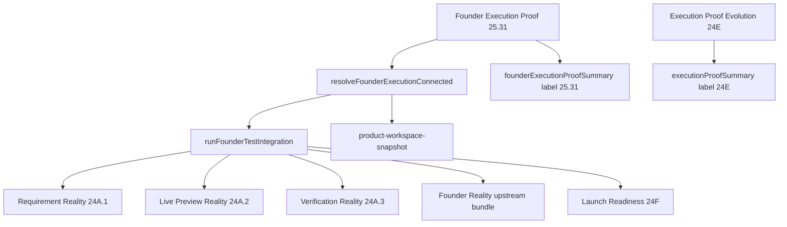

# Founder Execution Proof Propagation Report

**Phase:** 25.34 — Wire Founder Execution Proof into Founder Test Integration  
**Pass token:** `FOUNDER_EXECUTION_PROOF_PROPAGATION_PASS`

## Root cause

Phase 25.31 Founder Execution Proof could prove the full chain (`workspace → build → runtime → preview → verification`) and report `founderExecutionProven`, stage contracts, and ~94% founder proof — but Phase 24A/24F Founder Test Integration hardcoded `executionConnected: false` and `builderExecutionConnected: false` in authority collectors. Proof was assessed **after** authorities ran, so it could not affect Requirement Reality, Live Preview Reality, Verification Reality, or Founder Reality upstream scores. Launch Readiness and the product workspace snapshot therefore kept reporting BUILD blocked even when bounded execution proof existed.

## Files changed

| File | Change |
|------|--------|
| `src/founder-test-integration/founder-execution-connected-resolver.ts` | **NEW** — `resolveFounderExecutionConnected`, runtime/API helpers |
| `src/founder-test-integration/founder-test-integration-orchestrator.ts` | Thread `resolvedExecutionConnected` into 24A collectors |
| `src/founder-test-integration/founder-test-integration-authority.ts` | Proof-first ordering; resolve before authorities |
| `src/founder-test-integration/founder-test-integration-types.ts` | Input fields for proof assessment and resolved flag |
| `src/founder-test-integration/index.ts` | Export resolver helpers |
| `src/end-to-end-founder-workflow-reality/end-to-end-founder-workflow-reality-analyzers.ts` | `collectUpstreamRealityBundle(rootDir, builderExecutionConnected?)` |
| `src/end-to-end-founder-workflow-reality/end-to-end-founder-workflow-reality-authority.ts` | `assessFounderWorkflowReality` options override |
| `src/founder-test-launch-readiness/founder-test-launch-readiness-types.ts` | `founderExecutionProofInput`; separate 25.31 summary field |
| `src/founder-test-launch-readiness/founder-test-launch-readiness-authority.ts` | Pass proof input; format 25.31 summary |
| `src/founder-test-launch-readiness/founder-test-launch-readiness-report-builder.ts` | Label 24E vs 25.31 sections |
| `server/founder-testing-handler.ts` | Build/pass `founderExecutionProofInput` on `/api/founder-test/run` |
| `server/product-workspace-snapshot.ts` | `autonomousBuilder.executionConnected` from resolver |
| `scripts/validate-founder-execution-proof-propagation.ts` | **NEW** propagation validator |
| `package.json` | `validate:founder-execution-proof-propagation` script |

## Old truth path

```
assessFounderTestIntegration()
  → runFounderTestIntegration()
      → collectRequirementReality(executionConnected: false)   // hardcoded
      → collectLivePreviewReality(executionConnected: false)   // hardcoded
      → collectVerificationReality(executionConnected: false)    // default-false
      → collectFounderReality(builderExecutionConnected: false)
  → assessFounderExecutionProof()   // too late — cannot affect authority scores
```

Parallel UI path: `product-workspace-snapshot.ts` always set `autonomousBuilder.executionConnected: false`.

## New truth path

```
assessFounderTestIntegration()
  → assessFounderExecutionProof(founderExecutionProofInput)   // first
  → resolveFounderExecutionConnected(proof)                   // bounded true only when 25.31 proven
  → runFounderTestIntegration(resolvedExecutionConnected)
      → collectRequirementReality(resolvedExecutionConnected)
      → collectLivePreviewReality(resolvedExecutionConnected)
      → collectVerificationReality(resolvedExecutionConnected)
      → collectFounderReality(resolvedExecutionConnected → builderExecutionConnected)
  → assessFounderExecutionProof(with founderTestAssessment)   // summary for report
```

API: `/api/founder-test/run` → `buildRuntimeFounderExecutionProofInput(ROOT_DIR)` → launch readiness → `assessFounderTestIntegration`.

Snapshot: `resolveExecutionConnectedForRoot(rootDir)` → `autonomousBuilder.executionConnected`.

## Proof propagation chain



Resolver returns `executionConnected: true` only when:

- `founderExecutionProven === true`
- `executionChainConnected === true`
- All five stage contracts proven in `proofBundle`
- No critical execution-proof blocker

Controlled builder connectivity (`isControlledBuilderExecutionConnected`) augments source metadata but **does not** pass alone.

## Remaining limitations

- Live API without connected execution assessments still honestly resolves `executionConnected: false` — propagation fixes stale hardcoded false, not missing proof.
- Launch readiness verdict still requires founder acceptance, launch council, simulation, and other gates — execution proof propagation alone does not imply launch ready.
- Preview/runtime leaf inputs in 24A collectors remain bounded; `executionConnected` unlocks upstream signals but does not inflate preview URL or live session evidence without real data.
- `buildRuntimeFounderExecutionProofInput` passes `{ rootDir }` only; full validator-grade proof still requires injected connected assessments (as in `validate-founder-execution-proof.ts`).

## Validation result

Run:

```bash
npm run validate:founder-execution-proof-propagation
npm run validate:founder-test-launch-readiness
```

Expected pass token: `FOUNDER_EXECUTION_PROOF_PROPAGATION_PASS`
